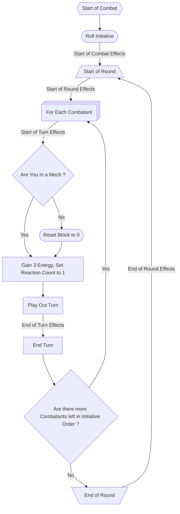

---
draft:
---

```mermaid
flowchart TB
    n1["Start of Combat"] --> n2(["Roll Initiative"])
    n2 -- Start of Combat Effects --> n4["Start of Round"]
    n4 -- Start of Round Effects --> n5["For Each Combatant"]
    n5 -- Start of Turn Effects --> n6["Are You In a Mech ?"]
    n6 -- No --> n7(["Reset Block to 0"])
    n6 -- Yes --> n8["Gain 3 Energy, Set Reaction Count to 1"]
    n7 --> n8
    n8 --> n9["Play Out Turn"]
    n9 -- End of Turn Effects --> n10["End Turn"]
    n10 --> n11["Are there more Combatants left in Initiative Order ?"]
    n11 -- Yes --> n5
    n11 -- No --> n12["End of Round"]
    n12 -- End of Round Effects --> n4

    n1@{ shape: hex}
    n4@{ shape: trap-b}
    n5@{ shape: procs}
    n6@{ shape: diam}
    n9@{ shape: rounded}
    n10@{ shape: rect}
    n11@{ shape: diam}
    n12@{ shape: trap-t}
```